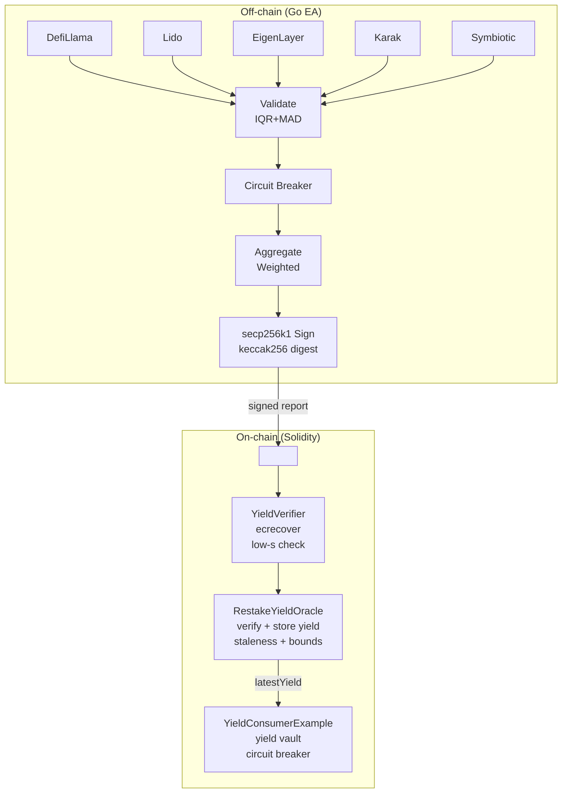

# Restake Yield Aggregator

A Chainlink External Adapter for aggregating and validating ETH restaking yield
data across multiple providers, with on-chain EIP-712 signature verification.


## Security Audit Highlights

This project was self-audited for a Chainlink Product Security Engineer
application. **3 critical vulnerabilities** were found and fixed:

1. **Oracle digest decoupling** — `submitReport` accepted a free-form digest,
   allowing value-substitution attacks. Fixed with EIP-712 on-chain digest
   reconstruction binding signatures to exact report values.
2. **EA↔Oracle signing mismatch** — Go EA signing was incompatible with
   Solidity verification. Fixed with a shared EIP-712 module, proven by a
   cross-language fixture test (`test_OracleAcceptsGoGeneratedFixture`).
3. **Vault flash-loan yield theft** — `_totalValue()` granted retroactive
   yield to new depositors. Fixed with share-based accounting; same-block
   deposit+withdraw yields zero profit.

**Full audit report**: [AUDIT_REPORT.md](AUDIT_REPORT.md) ·
**Threat model & policy**: [SECURITY.md](SECURITY.md)

| Metric | Value |
|--------|-------|
| Findings | 24 (3 critical, 5 high, 16 medium/low — all fixed) |
| Foundry tests | 74 (69 unit + 5 invariant, 256 runs × 128k calls) |
| Go test packages | 13 (all pass with `-race`) |
| Go fuzz executions | 700K+ (0 failures) |
| Slither | 0 high/critical/medium |
| gosec / golangci-lint | 0 issues |

## Overview

The adapter fetches Liquid Restaking Token (LRT) yields from multiple sources,
applies statistical validation and outlier filtering, runs the result through a
circuit breaker, aggregates it into a single weighted/median/trimmed/consensus
value, optionally signs it with secp256k1 for on-chain verification, and returns
it in the Chainlink External Adapter response format.

### Data sources

| Provider    | Source                              | Status | Notes |
|-------------|-------------------------------------|--------|-------|
| DefiLlama   | `yields.llama.fi` + `coins.llama.fi` | **Real, keyless** | Primary source. Real LRT pool data (weETH, ezETH, rsETH, …). No API key needed. |
| Lido        | `eth-api.lido.fi`                   | **Real, keyless** | Real stETH staking APR (7-day SMA). No API key needed. Parses Lido's actual response format. |
| EigenLayer  | configurable REST endpoint          | Stub | Generic REST client. Activates only when `EIGENLAYER_API` is set. Expects a JSON format that may not match EigenLayer's actual API. |
| Karak       | configurable REST endpoint          | Stub | Same as above. Activates only when `KARAK_API` is set. |
| Symbiotic   | configurable REST endpoint          | Stub | Same as above. Activates only when `SYMBIOTIC_API` is set. |

> **Provider status:** DefiLlama and Lido are fully implemented providers with
> protocol-specific response parsing and real API integration. EigenLayer,
> Karak, and Symbiotic are **extension points** — generic REST clients that
> activate when their respective `*_API` env vars are set. They expect a
> `{data: [{apy, tvl, ...}]}` JSON shape and are ready for protocol-specific
> parsers to be layered on. DefiLlama + Lido together cover both LRT pool
> yields and native liquid staking yield, which is sufficient for a working
> adapter covering the major restaking ecosystem.

## Key features

- **Multi-provider aggregation** — concurrent fetch with TVL-weighted, median,
  trimmed-mean, or confidence-scored consensus aggregation
- **Robust outlier filtering** — IQR + MAD (median absolute deviation) test that
  correctly handles small sample sizes (the IQR-only method fails when the
  outlier is also the Q3 value)
- **Circuit breaker** — trips on anomalous APY/TVL or provider loss, falls back
  to last-known-good metrics with configurable staleness TTL
  (`MAX_STALE_SECONDS`, default 300s). Stale fallback data is rejected so the
  adapter returns an error instead of serving potentially dangerous old values.
- **On-chain verifiable signatures** — secp256k1/keccak256 signatures
  compatible with Solidity `ecrecover` (see `contracts/`)
- **Multi-chain fan-out** — per-chain provider registry with caching and weights
- **Observability** — Prometheus metrics at `/metrics`, OpenTelemetry traces
  (OTLP/HTTP), structured logging, per-request access logs with request-ID
  propagation for end-to-end traceability
- **Production hardening** — request body size limits (1 MiB), response body
  size limits on provider fetches (16 MiB), security headers
  (`X-Content-Type-Options`, `X-Frame-Options`, `Referrer-Policy`,
  `Cache-Control`), NaN/Inf rejection in validation and aggregation
- **Kubernetes-ready** — `/health` liveness probe and `/readyz` readiness probe
  (returns 503 when no providers are configured or circuit breaker is open)
- **Chainlink EA spec** — POST `/` with `{id, data}`, returns
  `{jobRunID, status, data, result, error, pending}` where `jobRunID` is
  echoed from the request `id`, `status` is `"completed"` or `"errored"`,
  and `data.result` + top-level `result` contain the aggregated APY (for
  Flux Monitor and OCR job compatibility)

## Security

This project has been security-audited with a focus on the oracle loop
(EA signing → on-chain verification) and the vault accounting model. See
[SECURITY.md](SECURITY.md) for the full threat model and audit report.

### EIP-712 signed reports

The EA signs each report using EIP-712 typed data. The signature is bound
to the exact report values (APY, TVL, points, timestamp) and to the
oracle contract's domain separator (chainId + verifyingContract). This
prevents:

- **Value substitution** — a valid signature cannot be paired with
  different report values, because the oracle reconstructs the digest
  on-chain from the submitted parameters.
- **Cross-chain replay** — the domain separator includes chainId, so a
  signature valid on mainnet is invalid on Polygon.
- **Cross-contract replay** — the domain separator includes the
  verifying contract address, so a signature valid for one oracle
  deployment is invalid for another.
- **Same-chain replay** — the oracle enforces a monotonic timestamp:
  a report with timestamp T is rejected if a report with timestamp >= T
  has already been submitted.

### Hardware wallet signing

For production, the signing key should never live in a software
environment variable. The EA supports hardware-wallet signing via the
`SIGNING_PRIVATE_KEY` env var — set it to a hardware-wallet-backed key
using a tool like [Clef](https://getclef.org/) or a KMS provider. The
`DataIntegrityService.SignOnChainReport` method is the single signing
entry point and can be replaced with an HSM-backed implementation.

### Vault accounting

`YieldConsumerExample` uses share-based accounting to prevent flash-loan
yield theft. New deposits buy shares at the current (post-accrual) share
price, so a depositor who deposits and withdraws in the same block
receives exactly zero retroactive yield. Yield accrues only on existing
`totalAssets`, not on future deposits.

### Admin endpoint authentication

The `/circuit` and `/status` endpoints accept an optional bearer token
via the `ADMIN_TOKEN` environment variable. When set, requests must
include `Authorization: Bearer <token>`. The token comparison uses
`subtle.ConstantTimeCompare` to prevent timing attacks. When unset,
admin endpoints are unauthenticated (suitable for private networks).

### Pre-commit hook

A pre-commit hook with security checks is available at
`scripts/pre-commit.sh`. It runs `go vet`, `go test -race`, `forge test`,
and scans for hardcoded private keys.

```bash
cp scripts/pre-commit.sh .git/hooks/pre-commit
chmod +x .git/hooks/pre-commit
```

## Quick start

```bash
# Build
go build -o bin/restake-yield-ea ./cmd/server

# Run (DefiLlama + Lido, no API keys needed)
PORT=8080 ./bin/restake-yield-ea

# Test the endpoint
curl -s localhost:8080/health
curl -s -X POST localhost:8080/ -H 'Content-Type: application/json' \
  -d '{"id":"0x1","data":{}}' | jq
```

### Docker

```bash
docker build -t restake-yield-ea --build-arg VERSION=$(git rev-parse --short HEAD) .
docker run -p 8080:8080 restake-yield-ea
```

## Configuration

All configuration is via environment variables.

### Core

| Variable                | Default     | Description |
|-------------------------|-------------|-------------|
| `PORT`                  | `8080`      | HTTP server port |
| `TIMEOUT`               | `10s`       | Per-request timeout |
| `AGGREGATION_MODE`      | `weighted`  | `weighted`, `median`, `trimmed`, `consensus` |
| `ENABLE_VALIDATION`     | `true`      | Statistical validation + outlier filtering |
| `ENABLE_CIRCUIT_BREAKER`| `true`      | Circuit breaker protection |
| `ENABLE_METRICS`        | `true`      | Prometheus metrics at `/metrics` |
| `MAX_APY_THRESHOLD`     | `1.0`       | Max valid APY (decimal, 1.0 = 100%) |
| `MIN_PROVIDERS`         | `2`         | Min valid providers before circuit trips |
| `MAX_STALE_SECONDS`     | `300`       | Max age (seconds) for circuit breaker last-good fallback. 0 = no limit. |
| `CIRCUIT_RESET_DELAY`   | `5m`        | Delay before circuit breaker transitions from open to half-open |
| `ENABLED_PROVIDERS`     | *all*       | Comma-separated subset, e.g. `defillama,eigenlayer` |
| `LOG_LEVEL`             | `info`      | `debug`, `info`, `warn`, `error` |
| `LOG_FORMAT`            | `text`      | `text` or `json` |

### Provider endpoints

| Variable         | Default | Description |
|------------------|---------|-------------|
| `DEFILLAMA_API`  | `https://api.llama.fi` | DefiLlama base API |
| `DEFILLAMA_YIELDS_API` | `https://yields.llama.fi` | DefiLlama yields endpoint |
| `DEFILLAMA_PRICES_API` | `https://coins.llama.fi` | DefiLlama prices endpoint |
| `LIDO_API_URL`   | `https://eth-api.lido.fi/v1/protocol/steth/apr/sma` | Lido stETH APR API endpoint. |
| `EIGENLAYER_API` | *(none)* | EigenLayer REST endpoint. If unset, provider is disabled. |
| `KARAK_API`      | *(none)* | Karak REST endpoint. If unset, provider is disabled. |
| `SYMBIOTIC_API`  | *(none)* | Symbiotic REST endpoint. If unset, provider is disabled. |
| `API_KEYS`       | *(none)* | JSON map of provider→key, e.g. `{"eigenlayer":"..."}` |

### Enterprise features (opt-in)

| Variable                  | Default | Description |
|---------------------------|---------|-------------|
| `ENABLE_ENTERPRISE_FEATURES` | `false` | Master switch for enterprise features |
| `DATA_INTEGRITY_ENABLED`  | `false` | secp256k1 payload signing |
| `SIGNING_PRIVATE_KEY`     | *(generated)* | Hex private key for signing (0x-prefixed or bare). **Must be set in production** — the generated ephemeral key changes on every restart, breaking on-chain verification. |
| `VERIFICATION_REQUIRED`   | `false` | Reject requests if signature invalid |
| `SIGNATURE_VALIDITY`      | `24h`   | Signature TTL |
| `MULTICHAIN_ENABLED`      | `false` | Multi-chain fan-out |
| `RATE_LIMIT_RPS`          | `10`    | Requests per second |
| `RATE_LIMIT_BURST`        | `20`    | Burst size |
| `OTEL_ENDPOINT`           | *(none)* | OTLP/HTTP endpoint, e.g. `http://collector:4318` |
| `METRICS_EXPORT_ENABLED`  | `false` | Batch metrics export to webhook |

## API

### `POST /` — Chainlink EA endpoint

**Request**:
```json
{
  "id": "0x1234567890",
  "data": {}
}
```

**Response** (success):
```json
{
  "jobRunID": "0x1234567890",
  "status": "completed",
  "data": {
    "result": 0.0451,
    "apy": 0.0451,
    "tvl": 1250000,
    "pointsPerETH": 1.1,
    "provider": "aggregated-weighted",
    "collectedAt": 1715003456,
    "timestamp": 1715003457,
    "meta": {
      "latencyMs": 412,
      "metricCount": 12,
      "aggregationMode": "weighted"
    }
  },
  "result": 0.0451,
  "error": null,
  "pending": false
}
```

**Response** (error):
```json
{
  "jobRunID": "0x1234567890",
  "status": "errored",
  "statusCode": 503,
  "data": {},
  "error": {
    "name": "EAError",
    "message": "circuit open: all providers failed"
  },
  "pending": false
}
```

When the circuit breaker trips and falls back to last-known-good metrics,
`data.stale` is set to `true` and `meta.stale` is also set.

When `DATA_INTEGRITY_ENABLED=true`, the response is wrapped with an
`_signature` and `integrity` block that can be verified on-chain by the
`YieldVerifier` contract.

### Other endpoints

| Method | Path       | Description |
|--------|------------|-------------|
| GET    | `/health`  | Liveness probe |
| GET    | `/readyz`  | Readiness probe (503 if no providers or circuit open) |
| GET    | `/status`  | Server status, uptime, providers, circuit state |
| GET    | `/metrics` | Prometheus metrics |
| GET    | `/circuit` | Circuit breaker state |
| POST   | `/circuit?action=reset` | Reset the circuit breaker |

All responses include an `X-Request-ID` header (echoed from the request or
auto-generated) for end-to-end traceability. The EA response also includes
`meta.requestId`.

## On-chain verification & oracle loop (`contracts/`)

The adapter signs the keccak256 digest of a canonical JSON payload with
secp256k1, producing a 65-byte `r||s||v` signature (v in {0,1}). The
`YieldVerifier` Solidity contract normalises v to {27,28}, enforces low-s
malleability protection, and recovers the signer via `ecrecover`.

The `RestakeYieldOracle` contract completes the full Chainlink oracle loop:
it verifies the EA's signature, enforces staleness and deviation bounds, and
stores the latest yield on-chain for consumer contracts to read. The
`YieldConsumerExample` contract demonstrates the consumer side — a yield
vault that accrues restaking yield for depositors and trips a circuit breaker
when the oracle goes stale or reports implausible data.

### Architecture: the complete oracle loop



### Contracts

```
contracts/
├── src/
│   ├── YieldVerifier.sol          # Low-level signature verifier (ecrecover)
│   ├── RestakeYieldOracle.sol     # On-chain oracle: verify + store yield
│   └── YieldConsumerExample.sol   # Example DeFi consumer: yield vault
├── test/
│   ├── YieldVerifier.t.sol        # Verifier tests (incl. Go-fixture proof)
│   ├── RestakeYieldOracle.t.sol   # Oracle tests (signing, staleness, bounds)
│   ├── YieldConsumerExample.t.sol # Consumer tests (deposit, withdraw, accrual)
│   └── fixtures/signature.json    # Generated by contracts/script/genfixture.go
└── script/genfixture.go           # Go fixture generator
```

The Foundry test suite includes `test_VerifyGoGeneratedFixture` and
`test_OracleAcceptsGoGeneratedFixture`, which load a signature produced by
the Go adapter's `internal/security` package and assert that `ecrecover`
recovers the same address — proving end-to-end Go↔Solidity signature
compatibility through both the verifier and the oracle.

### `RestakeYieldOracle`

The oracle stores yield as integer basis points (1 bp = 0.01%) and TVL as
milli-ETH (1e-3 ETH) to avoid fixed-point precision issues. It enforces:

- **Signature verification** — every report must be signed by the authorised
  signer, verified via `YieldVerifier.verifyYield`
- **Staleness check** — rejects reports older than `stalenessThreshold`
- **APY bounds** — rejects APY outside `[minAPYBps, maxAPYBps]`
- **Deviation check** — rejects sudden APY jumps > `maxDeviationBps`
- **Access control** — OpenZeppelin `AccessControl` with `ADMIN_ROLE` and
  `UPDATER_ROLE`. Only authorised updaters can submit reports.
- **Pausable** — admins can pause report submission in emergencies (e.g.
  signer key compromise) via `pause()` / `unpause()`
- **Signer rotation** — admins can rotate the authorised signer
- **Events** — all state changes emit events for off-chain indexing

### `YieldConsumerExample`

A minimal yield vault that demonstrates the consumer side:

- Users deposit ETH and receive yield-bearing shares
- Share value accrues based on the oracle's latest APY (linear proration)
- OpenZeppelin `ReentrancyGuard` protects deposit and withdraw
- A circuit breaker halts withdrawals when the oracle is stale or reports
  an implausible APY, protecting depositors from bad data
- Anyone can call `accrueYield()` to update the index

### Run the Solidity tests

```bash
# Install Foundry: https://book.getfoundry.sh/getting-started/installation
forge install   # one-time, pulls forge-std + openzeppelin-contracts
go run contracts/script/genfixture.go   # regenerate the Go signature fixture
forge test -vv
```

## Development

### Prerequisites

- Go 1.24+
- Foundry (for Solidity tests)
- Docker (optional)
- Slither (optional, for Solidity security scanning): `pip3 install slither-analyzer`

### Build & test

```bash
go build ./...
go vet ./...
go test -race ./...
go test -run=^$ -bench=. ./internal/aggregate/...   # benchmarks
forge test                                            # Solidity
```

### Security scanning

```bash
# Go security scan
go run github.com/securego/gosec/v2/cmd/gosec@latest -severity medium ./...

# Go vulnerability check
go run golang.org/x/vuln/cmd/govulncheck@latest ./...

# Solidity security scan
slither . --config slither.config.json
```

### CI

The GitHub Actions pipeline (`.github/workflows/go.yaml`) runs 7 jobs:

- **Go**: build, vet, test with race detector, coverage reporting, benchmarks
- **golangci-lint**: 10 linters (errcheck, ineffassign, staticcheck, govet, gosec, misspell, unconvert, prealloc, gocritic, revive)
- **gosec**: Go static security analysis (medium severity)
- **govulncheck**: Go dependency vulnerability scan
- **Foundry**: Solidity build + test (including Go↔Solidity fixture proof)
- **Slither**: Solidity static security analysis
- **Docker**: multi-stage build verification

## Testing

### Unit tests (default)

```bash
go test -race -count=1 ./...
```

All packages have ≥98% statement coverage. The race detector is enabled.

### Integration tests (require network access)

Integration tests hit the real DefiLlama and Lido APIs and are excluded from
the default suite. Run them explicitly:

```bash
go test -tags=integration -run TestIntegration -v ./internal/fetch/...
```

These tests verify that:
- The DefiLlama client can fetch live LRT yield data and ETH prices.
- The Lido client can fetch the live stETH staking APR (7-day SMA).

They are intentionally lenient (structural assertions only, not specific
values, since yields change constantly).

### Benchmarks

```bash
go test -bench=. -benchmem -benchtime=1s ./internal/aggregate/...
```

Benchmarks compare the four aggregation modes (weighted, median, trimmed-mean,
consensus) across input sizes of 10, 100, and 1000 metrics.

## Deployment

### Local observability stack (Docker Compose)

A complete local stack with Prometheus + Grafana is available via
`docker-compose.yml`:

```bash
docker compose up -d
# EA:          http://localhost:8080
# Prometheus:  http://localhost:9090
# Grafana:     http://localhost:3000  (admin / admin)
```

The Grafana dashboard (auto-provisioned from `deploy/grafana/dashboard.json`)
shows:
- Request latency (p50/p95) and throughput by status
- Aggregated APY and TVL over time
- Per-provider latency and error rates
- Circuit breaker state

### Kubernetes

A production-ready Kubernetes manifest is in `deploy/k8s/`:

```bash
kubectl apply -f deploy/k8s/deployment.yaml
kubectl apply -f deploy/k8s/servicemonitor.yaml  # if using Prometheus Operator
```

The manifest includes:
- 2 replicas with rolling updates
- Liveness (`/health`) and readiness (`/readyz`) probes
- ConfigMap for all env vars, Secret for the signing private key
- Resource requests/limits (100m/64Mi → 500m/256Mi)
- ServiceMonitor for Prometheus scraping

### Project layout

```
cmd/server/            # HTTP server, Chainlink EA endpoint, E2E tests
contracts/
  src/                 # YieldVerifier, RestakeYieldOracle, YieldConsumerExample
  test/                # Foundry tests (74 tests across 4 suites)
  script/              # Go fixture generator for cross-language proof
deploy/
  k8s/                 # Kubernetes deployment + ServiceMonitor
  grafana/             # Grafana dashboard + provisioning
  prometheus/          # Prometheus scrape config
docker-compose.yml     # Local EA + Prometheus + Grafana stack
internal/
  aggregate/           # Weighted, median, trimmed-mean, consensus aggregation
  circuitbreaker/      # Circuit breaker with last-known-good fallback + staleness TTL
  config/              # Env-driven configuration
  enterprise/          # Metrics exporter (with retry queue), rate limiting hooks
  envx/                # Typed env-var helpers (String, Int, Float64, Duration, Bool)
  fetch/               # DefiLlama + Lido (real), EigenLayer/Karak/Symbiotic (extension points), MultiChain
  model/               # Metric type
  otel/                # OpenTelemetry tracing (OTLP/HTTP)
  provider/            # Shared Provider interface
  security/            # secp256k1 signing + EIP-712 typed-data digest + tamper-proof wrappers
  types/               # Shared chain + config types
  validation/          # IQR+MAD outlier filter, confidence scoring
```

## License

MIT
