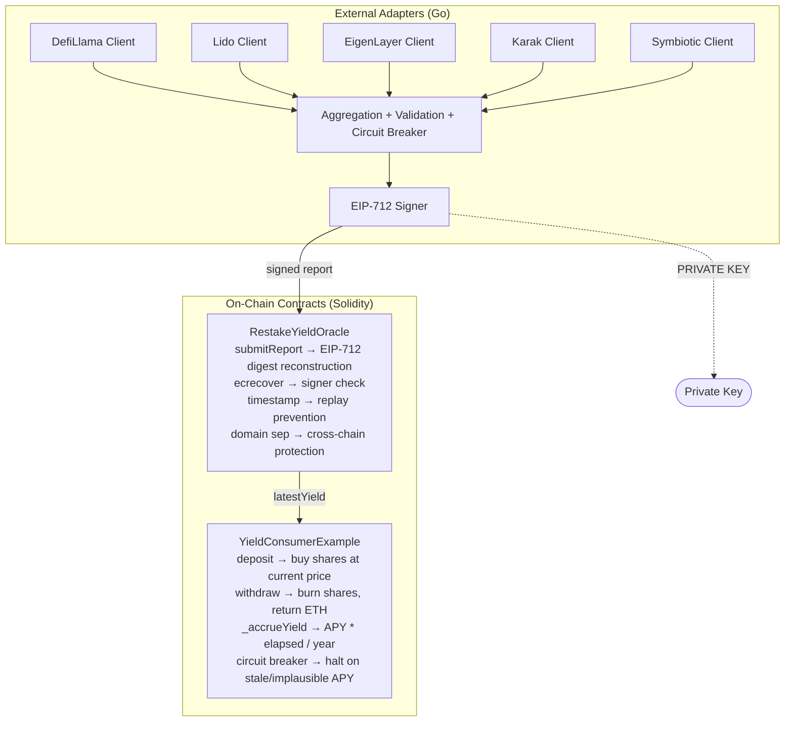

# Security Policy

## Reporting a Vulnerability

If you discover a vulnerability in this project, please **do not** open a
public GitHub issue. Instead, email the maintainer directly or use GitHub's
private vulnerability reporting feature.

- **Response time**: within 48 hours
- **Disclosure**: coordinated disclosure after a fix is released

## Supported Versions

| Version | Supported          |
|---------|--------------------|
| main    | :white_check_mark: |
| < 1.0   | :x: (pre-release)  |

---

## Threat Model

### Assets

1. **Oracle report integrity** — the APY/TVL/Points values consumed by
   on-chain contracts. If tampered, depositors in `YieldConsumerExample`
   receive incorrect yield accruals.
2. **Signer private key** — the EIP-712 signing key used by the EA to sign
   reports. If compromised, an attacker can submit arbitrary reports.
3. **Depositor funds** — ETH locked in `YieldConsumerExample`. Share-based
   accounting must ensure no depositor can steal another's accrued yield.
4. **EA availability** — the external adapter must remain responsive under
   load and during provider outages.

### Attack Surfaces

| Surface | Threat | Mitigation |
|---------|--------|------------|
| `submitReport` digest | Value-substitution: valid signature paired with wrong values | EIP-712 digest reconstructed on-chain from report params |
| Signature replay | Same signature reused on different chain/contract | Domain separator (chainId + verifyingContract) + monotonic timestamp |
| `setSigner` | Old signer retains UPDATER_ROLE after rotation | `setSigner` revokes old signer's role |
| Vault deposit/withdraw | Flash-loan yield theft via same-block deposit+withdraw | Share-based accounting: new deposits buy shares at post-accrual price |
| Circuit breaker | Concurrent Check() proceeds while breaker trips | State recheck after write lock acquisition |
| Admin endpoints | Unauthorised access to /circuit, /status | Optional ADMIN_TOKEN bearer auth (constant-time compare) |
| X-Forwarded-For | Spoofed XFF pollutes logs | XFF honoured only from TRUSTED_PROXY IP |
| Request data echo | Client overwrites response fields (result, apy) | Whitelist of echoable keys (chain, symbol, mode, provider) |
| Provider data | Implausible APY, stale data, TVL manipulation | Circuit breaker thresholds + staleness check + last-good fallback |
| PointsPerETH | Fake 1.0 values skew aggregation | 0 = not available; excluded from median calculation |

### Trust Boundaries



### Assumptions

- The EA runs on a private network behind the Chainlink node. ADMIN_TOKEN
  auth is optional because the EA is not directly internet-facing.
- The signer private key is stored in an environment variable or HSM. For
  production, hardware-wallet signing is recommended (see README).
- Provider APIs (DefiLlama, Lido) are trusted for data but their responses
  are validated against plausibility thresholds.
- The oracle contract's owner is a multisig or governance contract.

---

## Audit Report

### Scope

- `contracts/src/RestakeYieldOracle.sol`
- `contracts/src/YieldVerifier.sol`
- `contracts/src/YieldConsumerExample.sol`
- `cmd/server/` (Go EA)
- `internal/security/eip712.go`
- `internal/circuitbreaker/breaker.go`
- `internal/aggregate/aggregate.go`

### Findings Summary

| ID | Severity | Title | Status |
|----|----------|-------|--------|
| P0-01 | Critical | Oracle digest decoupled from report params | Fixed |
| P0-02 | Critical | EA↔Oracle signing scheme mismatch | Fixed |
| P0-03 | Critical | Vault flash-loan yield theft | Fixed |
| P1-04 | High | No on-chain replay prevention | Fixed |
| P1-05 | High | Circuit breaker race condition | Fixed |
| P1-06 | High | setSigner does not revoke old role | Fixed |
| P1-07 | Medium | Admin endpoints unauthenticated | Fixed |
| P1-08 | Medium | Lido TVL hardcoded | Fixed |
| P2-09 | Low | Stale coverage.out in repo | Fixed |
| P2-10 | Low | PointsPerETH fake 1.0 values | Fixed |
| P2-11 | Low | weightedPoints semantically incorrect | Fixed |
| P2-12 | Low | Duplicated env helpers | Fixed |
| P2-13 | Medium | Request data echo blacklist | Fixed |
| P2-14 | Medium | Metrics exporter drops failed batches silently | Fixed |
| P2-15 | Low | WeightedParallel goroutine-per-metric | Fixed |
| P2-16 | Medium | clientIP trusts XFF unconditionally | Fixed |
| RC-26 | Low | verifyYield return value not checked against authorisedSigner | Fixed |
| RC-27 | Medium | maxRetries not enforced + drainRetryQueue not called on empty batch | Fixed |
| RC-28 | Low | Invariant tests waste 93% of fuzz calls on oracle admin functions | Fixed |
| RC-29 | Low | Lido TVL fallback magic number not configurable | Fixed |
| RC-30 | Low | 17 golangci-lint issues | Fixed |
| RC-31 | Low | Slither findings not documented | Fixed |
| RC-32 | Low | No separate audit report document | Fixed |

**Full finding details**: see [AUDIT_REPORT.md](AUDIT_REPORT.md).

### Audit Methodology

1. **Manual review** — line-by-line review of all production code paths
   (3 Solidity contracts, 7 Go packages, 5,633 LOC)
2. **Static analysis** — Slither (101 detectors), gosec, golangci-lint
   (10 linters), govulncheck
3. **Dynamic testing** — 74 Foundry tests (69 unit + 5 invariant), 13 Go
   packages with `-race`, 3 Go fuzz targets (700K+ executions)
4. **Cross-language proof** — Go-signed fixture verified by Solidity
   `ecrecover` on-chain
5. **Threat modeling** — STRIDE-based analysis of the oracle loop

### Verification

- **Solidity**: 74 Foundry tests pass (69 unit + 5 invariant, including
  value-substitution, cross-chain replay, flash-loan attack mitigation,
  role hygiene, vault solvency invariants).
- **Go**: 13 packages pass with `-race` (including circuit-breaker race
  regression, EIP-712 cross-language digest verification, admin auth,
  retry-queue exhaustion).
- **EIP-712 cross-language proof**: `genfixture.go` produces a Go-signed
  fixture that is verified by the Solidity oracle on-chain
  (`test_OracleAcceptsGoGeneratedFixture`).
- **Fuzzing**: 3 Go fuzz targets, 700K+ executions, 0 failures.

### Dependencies

#### Ziren (github.com/ProjectZKM/Ziren)

The `zkvm_runtime` package from ProjectZKM/Ziren is an **indirect**
dependency (pulled in transitively, not imported by any Go source file in
this project). It provides a zkVM runtime for zero-knowledge proof
verification. Since it is not directly used by the EA's code path, it
does not affect the oracle's signing or aggregation logic. If a future
version of a direct dependency upgrades Ziren, the change should be
reviewed for:
- Supply-chain integrity (verify the module checksum against the
  upstream repository).
- Any new transitive dependencies introduced.
- Whether the EA's direct dependencies still function correctly.

To audit the dependency tree:
```bash
go mod why github.com/ProjectZKM/Ziren/crates/go-runtime/zkvm_runtime
go mod graph | grep ziren
```

### Static Analysis Results

#### Slither (Solidity)

Slither was run with `slither . --config slither.config.json` (fail_on:
medium). The following findings were identified and triaged:

| Detector | Severity | Location | Status | Notes |
|----------|----------|----------|--------|-------|
| unused-return | LOW | `RestakeYieldOracle.submitReport` | **Fixed** | `verifyYield` return value now explicitly checked against `authorisedSigner` |
| incorrect-equality | MEDIUM | `RestakeYieldOracle.isStale` | Suppressed | `== 0` is a "never set" sentinel check, not arithmetic comparison. Inline `slither-disable-next-line` |
| incorrect-equality | MEDIUM | `YieldConsumerExample.balanceOf` | Suppressed | `totalShares == 0` is a sentinel, not arithmetic. Inline `slither-disable-next-line` |
| incorrect-equality | MEDIUM | `YieldConsumerExample._sharePrice` | Suppressed | `totalShares == 0` guards against zero-division. Inline `slither-disable-next-line` |
| incorrect-equality | MEDIUM | `YieldConsumerExample._accrueYield` | Suppressed | `elapsed == 0` guards against zero-division before share-price calc. Inline `slither-disable-next-line` |
| timestamp | LOW | `RestakeYieldOracle.submitReport` | Accepted | `block.timestamp` comparison for staleness is the intended design |
| timestamp | LOW | `RestakeYieldOracle.isStale` | Accepted | Same as above |
| timestamp | LOW | `YieldConsumerExample.balanceOf` | False positive | `totalShares == 0` is a sentinel, not timestamp arithmetic |
| timestamp | LOW | `YieldConsumerExample._sharePrice` | False positive | Same as above |
| timestamp | LOW | `YieldConsumerExample._accrueYield` | Accepted | `block.timestamp` delta for yield accrual is the intended design |
| assembly | INFO | `YieldVerifier._verifyYield` | Accepted | Inline assembly for signature parsing is gas-efficient and audited |
| low-level-calls | INFO | `YieldConsumerExample.withdraw` | Accepted | `call{value:}()` is the standard ETH transfer pattern; return value is checked |

**Summary**: 1 real finding (unused-return, fixed), 4 false-positive
incorrect-equality findings suppressed inline with `slither-disable-next-line`,
7 low/informational false positives or accepted-by-design patterns. Slither
exits 0 with `fail_on: medium`.

#### gosec (Go)

gosec was run with `gosec -severity medium -confidence medium ./...`.
**0 issues found.** (The previous `-exclude G104` exclusion was removed after
the G104 findings in `internal/fetch/lido.go` were fixed with idiomatic
`defer resp.Body.Close()`.)

#### golangci-lint (Go)

golangci-lint was run with the project `.golangci.yml` config (errcheck,
ineffassign, staticcheck, govet, gosec, misspell, unconvert, prealloc,
gocritic, revive). **0 issues found.**

#### govulncheck (Go)

govulncheck is run in CI. No known vulnerabilities in the dependency tree
at the time of the last audit.
